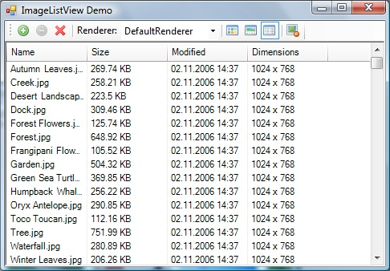

# View Modes #

ImageListView can display image thumbnails in the following view modes:

## Thumbnails ##

In this mode, thumbnails are laid out in a grid. The view can be scrolled vertically.

## Gallery ##

In this mode, a single row of thumbnails are displayed at the bottom. The view can be scrolled horizontally.

## Pane ##

In this mode, a large preview image and image metadata is displayed in the left pane.

## Details ##

In this mode, columns with image details are shown. Thumbnail images are not displayed. The view can be scrolled vertically.

## HorizontalStrip ##

A single row of thumbnails are displayed at the top of the control. The view can be scrolled horizontally.

## VerticalStrip ##

A single column of thumbnails are displayed aligned to the left of the control. The view can be scrolled vertically.