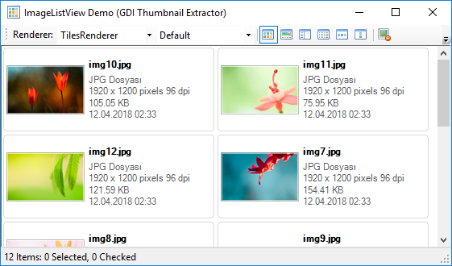
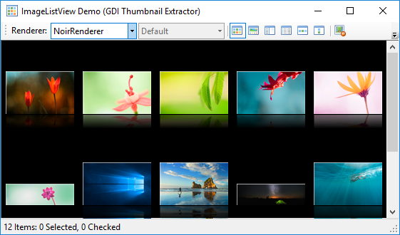

  

    

      <strong>ImageListView</strong>
    

    
a winforms control for image files with asynchronously loaded thumbnails

    

      
      &nbsp;&nbsp;&nbsp;
      
    

    

      @Articles.Introduction
      &nbsp;|&nbsp;
      @Api.Home
    

  

  

    

      

      

      

      

      

      

      

    

    

  

